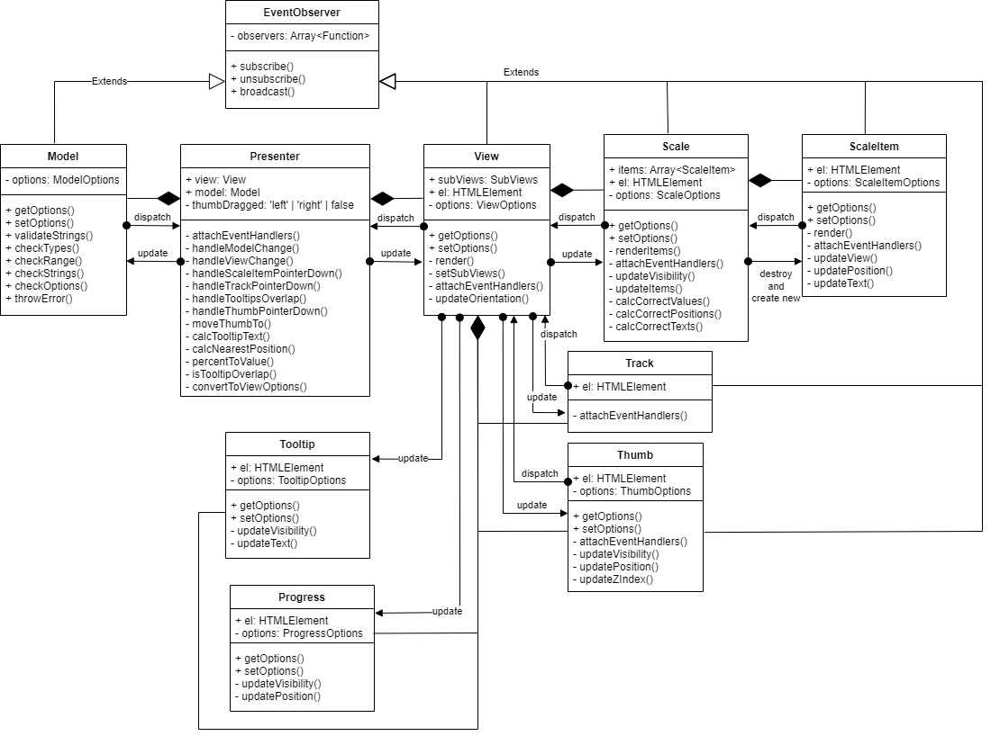

# range-slider
Четвертое задание из обучающей программы MetaLamp.

## Описание проекта
Проект представляет из себя [JQuery](https://jquery.com/) плагин, реализующий функционал слайдера с ползунком.

Проект разделён на две части: **range-slider** плагин и **веб страница**, на которой показаны разные варианты использования плагина и панели, с помощью которых можно посмотреть как влияют на отображение слайдера его параметры.

## GitHub Pages
[**Demo Page**](https://staya-bomjei.github.io/range-slider)

## Развертывание

### Клонировать репозиторий:

```
  git clone https://github.com/staya-bomjei/range-slider.git
```

`npm install` - устанавливает все зависимости проекта

### Сборка проекта:

`npm run start` - запускает локальный сервер на порту **4200**, на котором будет собираться проект

`npm run dev` - собирает проект без минификации файлов в директорию `./dist`

`npm run prod` - собирает проект c минификацией файлов и оптимизацией импортов в директорию `./dist`

### Linting
`npm run stylelint` - запускает линтинг scss файлов по стандарту airbnb

`npm run eslint` - запускает линтинг ts файлов по стандарту airbnb

### Testing
`npm run test` - запускает все тесты и генерирует карту покрытия тестами

### GitHub Pages
`npm run deploy` - собирает проект в режиме production и пушит собранный проект в ветку gh-pages

## Архитектура плагина
Плагин построен на архитектуре [MVP Passive View](https://ru.wikipedia.org/wiki/Model-View-Presenter)

### Диаграмма

> Примечание: на данной диаграмме стрелками с ромбами показано отношение композиции.

> Примечание: на данной диаграмме dispatch стрелками показано, как осуществляется проброс событий, например, ScaleItem пробрасывает свои события в Scale, которая в свою очередь пробрасывает события во View, а View пробрасывает полученные события в Presenter.

>Примечание: как видно в данной диаграмме ScaleItem принадлежат к Scale и не принадлежат прямо View, такое решение было обусловлено тем, что значения опций каждого ScaleItem полностью зависят от опций Scale, т.е. это означает, что при изменении любого параметра из Model, который влияет на параметры ScaleOptions, нужно перерисовать все ScaleItems (на самом деле, можно было бы не рендерить все ScaleItems заново, а изменить их параметры и добавить или убавить новых ScaleItems, но я так не сделал, потому что на опции ScaleOptions влияют такие опции ModelOptions, на которые не может повлиять пользователь, т.е. их изменить можно только программно).

### Отвязывание слоёв плагина
В данной реализации View ничего не знает о тех, кто его использует. Его опции, а также опции его subViews, необходимы и достаточны для отображения любого состояния слайдера. Любые события, которые генерируются при взаимодействии с subViews, пробрасываются во View, который в свою очередь пробрасывает эти события всем, кто на него подписался (в данном случае, только Presenter). 

Model так же отвязана, ничего не знает о том, кто её использует. Её опции описывают исключительно корректное состояние слайдера. При изменении Model, она пробрасывает свои новые опции всем, кто на неё подписался (в данном случае, только Presenter).

Presenter - связующее Model и View звено. Он обрабатывает все события генерируемые View, и соответственно обновляет Model, а так же он обновляет View при изменении Model.

### Проследим цепочку действий при обновлении модели
Допустим, что слайдер был проинициализирован, а модель имеет значение опций по умолчанию.
1. Чтобы цепочка началась, кто-то или что-то должен вызвать метод Model setOptions(), который проверяет 2 главные вещи: переопределяют ли переданные опции оригинальные опции модели и будут ли опции корректными, если их обновить;
    * в случае провала валидации, модель выбрасывает исключение;
    * в случае отсутствия переопределяющих опций, Model ничего не делает;
1. представим, что валидация прошла успешно, значит следующим шагом будет уведомление всех подписчиков (в данном случае, только Presenter);
1. Presenter отлавливает новые опции модели в методе handleModelChange();
1. теперь он вычисляет, какие опции во View нужно изменить, чтобы они пришли в соответствие с опциями Model;
1. обновляет View.

### Проследим цепочку действий при обновлении отображения
Допустим, что слайдер был проинициализирован и уже какое-то время успешно работал.
1. Чтобы цепочка началась, пользователь должен по-взаимодействовать с отрендеренными в браузере элементами View и subViews, представим, что он нажал на некоторое место на траке слайдера;
1. subView Track отлавливает событие клика пользователя и пробрасывает его во View;
1. View отлавливает событие переданное Track, и пробрасывает его в Presenter;
1. Presenter отлавливает событие и определяет метод, которым он будет его обрабатывать, на сей раз он использует handleTrackMouseDown();
1. в этом методе он находит ближайший к точке клика ползунок (пусть будет левый), вычисляет ближайшую к этой точке корректную позицию, затем вычисляет из этой позиции обновлённое свойство valueFrom модели и устанавливает его ей;
1. таким образом, далее идёт цепочка действий при обновлении модели.

## Опции плагина
| Опция | Значение по умолчанию | Описание |
|-------|-----------------------|----------|
| **min**: number | 0 | Минимальное значение слайдера, не может быть больше или равно **max** |
| **max**: number | 100 | Максимальное значение слайдера, не может быть меньше или равно **min** |
| **step**: number | 1 | Размер шага в слайдере, не может быть меньше либо равен нулю |
| **strings**: string[] | - | Массив строк, которые будут использоваться вместо значений слайдера, а так же будут отображаться на его шкале, причём, если эта опция указана, то запрещено указывать эти опции: **min**, **max**, **step**; а также значение опции **scaleParts** должно быть меньше чем количество элементов **strings** |
| **valueFrom**: number | 50 | Значение первого ползунка, оно должно попадать в интервал [**min**, **max**], а так же разница (**valueFrom** - **min**) должна быть кратна **step**, за исключением случая, когда **valueFrom** равно **max** |
| **valueTo**: number | - | Значение второго ползунка, оно должно попадать в интервал [**min**, **max**], а так же разница (**valueTo** - **min**) должна быть кратна **step**, за исключением случая, когда **valueTo** равно **max** |
| **isRange**: boolean | **false** | Если **true** - то у слайдера будет два ползунка, иначе - только один. Количество ползунков влияет на положение шкалы прогрессе, с одним ползунком шкала будет растягиваться от начала трека до ползунка, с двумя оно будет растягиваться от левого ползунка до правого |
| **orientation**: 'vertical' \| 'horizontal' | 'horizontal' | Положение слайдера |
| **showScale**: boolean | **true** | Видимость шкалы, если **true** - то шкалу видно, иначе - не видно |
| **scaleParts**: number | 4 | Количество частей у шкалы слайдера, причём количество частей не может быть больше, чем количество валидных значений в интервале [**min**, **max**]. Если указана опция **strings**, то значение должно быть меньше чем количество элементов **strings** |
| **showTooltip**: boolean | **true** | Видимость подсказок над ползунками, если **true** - то их видно всегда, иначе их не видно |
| **showProgress**: boolean | **true** | Видимость шкалы прогресса, если **true** - то её видно, иначе - не видно |

## Установка плагина
Чтобы использовать этот плагин нужны два файла `range-slider.js` и `range-slider.css`, взять их можно из ветки gh-pages, они лежат в директории `js/plugins/range-slider/`. Или можно клонировать этот репозиторий и, установив все зависимости и самостоятельно собрав проект, можно взять нужные файлы в директории `dist/js/plugins/range-slider/`.

Теперь, прежде чем начать пользоваться плагином вам нужно подключить JQuery любым удобным способом, а затем файлы плагина.

### Пример:
Допустим, что вы решили подключить JQuery с помощью CDN, получили файлы плагина и создали такую структуру файлов:
```
|-src
| |-range-slider.js
| |-range-slider.css
| |-index.html
| |-scripts.js
```
В index.html вы подключаете JQuery, файлы плагина, собственные скрипты:
```html
<!doctype html>
<html lang="en">
<head>
  <meta charset="utf-8">
  <meta name="viewport" content="width=device-width, initial-scale=1">
  <title>Range Slider</title>
  <link rel="stylesheet" href="range-slider.css">
  <script src="https://code.jquery.com/jquery-3.6.0.min.js" integrity="sha256-/xUj+3OJU5yExlq6GSYGSHk7tPXikynS7ogEvDej/m4=" crossorigin="anonymous"></script>
  <script defer src="range-slider.js"></script>
  <script defer src="scripts.js"></script>
</head>
<body>
  <div class="js-slider"></div>
</body>
</html>
```

## Использование плагина
### Инициализация
Чтобы проинициализировать плагин для всех элементов можно поступить так:
```javascript
$('.js-slider').rangeSlider();

// Или так
$('.js-slider').rangeSlider('init', {});
```
В двух этих случаях слайдер проинициализируется параметрами по-умолчанию, чтобы использовать собственные параметры, вы должны передать в инициализатор объект с параметрами:

```javascript
const myOptions = {
  min: -50,
  max: 50,
  step: 2,
  valueFrom: -50,
  isRange: false,
  orientation: 'vertical',
  scaleParts: 4,
};

$('.js-slider').rangeSlider(myOptions);

// Или так
$('.js-slider').rangeSlider('init', myOptions);
```

### Получение текущего состояния слайдера
Если вы проинициализировали ваш слайдер и хотите узнать, какое у него сейчас состояние, то можете использовать метод `get`:

```javascript
$slider = $('.js-slider').rangeSlider(myOptions);

const sliderOptions = $slider.rangeSlider('get');
```

Метод `get` возвращает опции последнего слайдера в JQuery объекте, поэтому если вы проинициализировали несколько слайдеров с помощью одного селектора, то вы можете разделить их в разные JQuery объекты и пользоваться методами плагина для конкретного экземпляра.

### Программное изменение состояния слайдера
Иногда вам может потребоваться изменить состояние слайдера программно, для этого можно использовать метод `set`:

```javascript
const newOptions {
  isRange: true,
  valueTo: 50,
};

$slider.rangeSlider('set', newOptions);
```

Метод `set`, устанавливает новые опции для модели, перезаписывая старые. Будьте внимательны, если вы передадите некорректные опции, или опции, которые в сумме с перекрываемыми оригинальными опциями являются некорректными, то будет выброшено исключение.

### Реагирование на изменение состояния слайдера
Если вам нужно выполнить какое-либо действие при изменении слайдера, то вы можете использовать метод `onchange`:

```javascript
const callback(data) {
  console.log('DON\'t TOUCH ME THERE!');
  console.log('THERE:', data);
};

$slider.rangeSlider('onchange', callback);
```

Примечательно то, что слайдер уведомляет `callback` не только об изменении слайдера пользователем, но и о программном изменении. А так же `callback` может принимать один параметр - объект состоящий из опций, которые были изменены в слайдере.

## Node Version
**v16.13.1**

## Зависимости
В данном проекте нет зависимостей, за исключением [JQuery](https://jquery.com/), который подключается на демонстрационной странице с помощью CDN.
