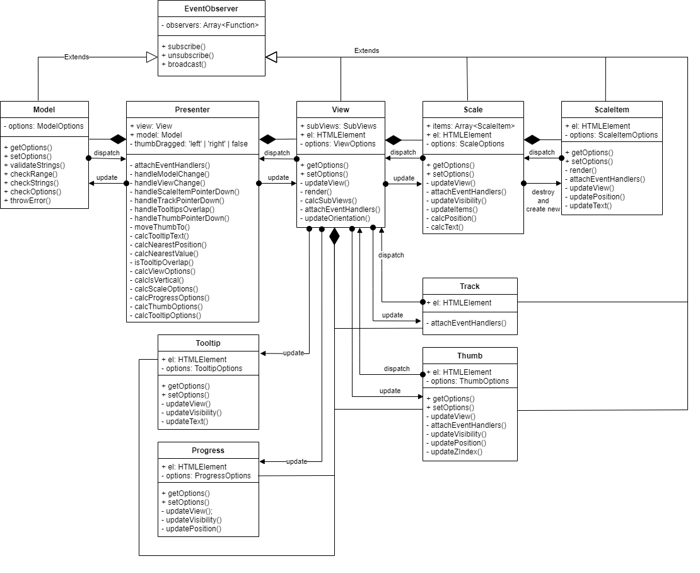

# range-slider
Четвертое задание из обучающей программы MetaLamp.

## Описание проекта
Проект представляет из себя [JQuery](https://jquery.com/) плагин, реализующий функционал слайдера с ползунком.

Проект разделён на две части: **range-slider** плагин и **веб страница**, на которой показаны разные варианты использования плагина и панели, с помощью которых можно посмотреть как влияют на отображение слайдера его параметры.

## GitHub Pages
[**Demo Page**](https://staya-bomjei.github.io/range-slider)

## Развертывание

### Клонировать репозиторий:

```
  git clone https://github.com/staya-bomjei/range-slider.git
```

`npm install` - устанавливает все зависимости проекта

### Сборка проекта:

`npm run start` - запускает локальный сервер на порту **4200**, на котором будет собираться проект

`npm run dev` - собирает проект без минификации файлов в директорию `./dist`

`npm run prod` - собирает проект c минификацией файлов и оптимизацией импортов в директорию `./dist`

### Linting
`npm run stylelint` - запускает линтинг scss файлов по стандарту airbnb

`npm run eslint` - запускает линтинг ts файлов по стандарту airbnb

### Testing
`npm run test` - запускает все тесты и генерирует карту покрытия тестами

### GitHub Pages
`npm run deploy` - собирает проект в режиме production и пушит собранный проект в ветку gh-pages

## Архитектура плагина
Плагин построен на архитектуре [MVP Passive View](https://ru.wikipedia.org/wiki/Model-View-Presenter)

### Диаграмма

> Примечание: на данной диаграмме стрелками с ромбами показано отношение композиции, но оно так же показывает, как осуществляется проброс событий, например, Thumb пробрасывает свои события во View, а View пробрасывает полученные события в Presenter.

### Отвязывание слоёв плагина
В данной реализации View ничего не знает о тех, кто его использует. Его опции, а также опции его subViews, необходимы и достаточны для отображения любого состояния слайдера. Любые события, которые генерируются при взаимодействии с subViews, пробрасываются во View, который в свою очередь пробрасывает эти события всем, кто на него подписался (в данном случае, только Presenter). 

Model так же отвязана, ничего не знает о том, кто её использует. Её опции описывают исключительно корректное состояние слайдера. При изменении Model, она пробрасывает свои новые опции всем, кто на неё подписался (в данном случае, только Presenter).

Presenter - связующее Model и View звено. Он обрабатывает все события генерируемые View, и соответственно обновляет Model, а так же он обновляет View при изменении Model.

### Проследим цепочку действий при обновлении модели
Допустим, что слайдер был проинициализирован, а модель имеет значение опций по умолчанию.
1. Чтобы цепочка началась, кто-то или что-то должен вызвать метод Model setOptions(), который проверяет 2 главные вещи: переопределяют ли переданные опции оригинальные опции модели и будут ли опции корректными, если их обновить;
    * в случае провала валидации, модель выбрасывает исключение;
    * в случае отсутствия переопределяющих опций, Model ничего не делает;
1. представим, что валидация прошла успешно, значит следующим шагом будет уведомление всех подписчиков (в данном случае, только Presenter);
1. Presenter отлавливает новые опции модели в методе handleModelChange();
1. теперь он вычисляет, какие опции во View нужно изменить, чтобы они пришли в соответствие с опциями Model;
1. обновляет View.

### Проследим цепочку действий при обновлении отображения
Допустим, что слайдер был проинициализирован и уже какое-то время успешно работал.
1. Чтобы цепочка началась, пользователь должен по-взаимодействовать с отрендеренными в браузере элементами View и subViews, представим, что он нажал на некоторое место на траке слайдера;
1. subView Track отлавливает событие клика пользователя и пробрасывает его во View;
1. View отлавливает событие переданное Track, и пробрасывает его в Presenter;
1. Presenter отлавливает событие и определяет метод, которым он будет его обрабатывать, на сей раз он использует handleTrackMouseDown();
1. в этом методе он находит ближайший к точке клика ползунок (пусть будет левый), вычисляет ближайшую к этой точке корректную позицию, затем вычисляет из этой позиции обновлённое свойство valueFrom модели и устанавливает его ей, таким образом, далее идёт цепочка действий при обновлении модели.

## Опции плагина
| Опция | Значение по умолчанию | Описание |
|-------|-----------------------|----------|
| **selector**: string | - | Селектор элементов, которые нужно сделать слайдерами, эта опция обязательна при инициализации |
| **min**: number | 0 | Минимальное значение слайдера, не может быть больше или равно **max** |
| **max**: number | 100 | Максимальное значение слайдера, не может быть меньше или равно **min** |
| **step**: number | 1 | Размер шага в слайдере, не может быть равен нулю |
| **strings**: string[] | - | Массив строк, которые будут использоваться вместо значений слайдера, а так же будут отображаться на его шкале, причём, если эта опция указана, то запрещено указывать эти опции: **min**, **max**, **step**; а также значение опции **scaleParts** должно быть меньше чем количество элементов **strings** |
| **valueFrom**: number | 50 | Значение первого ползунка, оно должно попадать в интервал [**min**, **max**], а так же разница (**valueFrom** - **min**) должна быть кратна **step**, за исключением случая, когда **valueFrom** равно **max** |
| **valueTo**: number | - | Значение второго ползунка, оно должно попадать в интервал [**min**, **max**], а так же разница (**valueTo** - **min**) должна быть кратна **step**, за исключением случая, когда **valueTo** равно **max** |
| **isRange**: boolean | **false** | Если **true** - то у слайдера будет два ползунка, иначе - только один. Количество ползунков влияет на положение шкалы прогрессе, с одним ползунком шкала будет растягиваться от начала трека до ползунка, с двумя оно будет растягиваться от левого ползунка до правого |
| **orientation**: 'vertical' \| 'horizontal' | 'horizontal' | Положение слайдера |
| **showScale**: boolean | **true** | Видимость шкалы, если **true** - то шкалу видно, иначе - не видно |
| **scaleParts**: number | 4 | Количество частей у шкалы слайдера, причём количество частей не может быть больше, чем количество валидных значений в интервале [**min**, **max**]. Если указана опция **strings**, то значение должно быть меньше чем количество элементов **strings** |
| **showTooltip**: boolean | **true** | Видимость подсказок над ползунками, если **true** - то их видно всегда, иначе их не видно |
| **showProgress**: boolean | **true** | Видимость шкалы прогресса, если **true** - то её видно, иначе - не видно |

## Установка плагина
Чтобы использовать этот плагин нужны два файла `range-slider.js` и `range-slider.css`, взять их можно из ветки gh-pages, они лежат в директории `js/plugins/range-slider/`. Или можно клонировать этот репозиторий и, установив все зависимости и самостоятельно собрав проект, можно взять нужные файлы в директории `dist/js/plugins/range-slider/`.

Теперь, прежде чем начать пользоваться плагином вам нужно подключить JQuery любым удобным способом, а затем файлы плагина.
> TODO: Вот тут надо пример html кода с подключенными JQuery и плагином

## Использование плагина
> TODO: здесь уже должен быть пример JS кода

> Инициализация слайдера

> Изменение состояния слайдера

> Реагирование на изменение слайдера

## Node Version
**v16.13.1**

## Зависимости
В данном проекте нет зависимостей, за исключением [JQuery](https://jquery.com/), который подключается на демонстрационной странице с помощью CDN.
